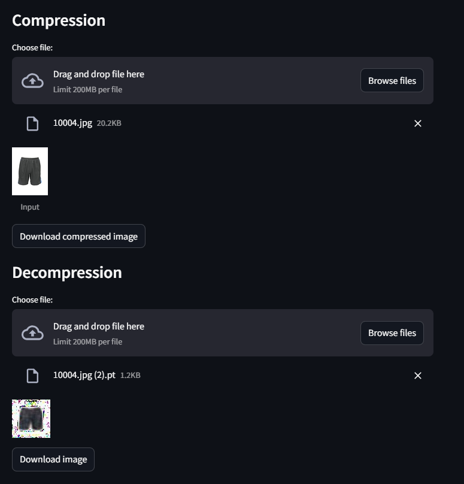

# Neural Lossy Compression

A lossy image compression using variational auto encoder on fashion mnist dataset

Inspired from paper [An Introduction to Variational Auto Encoders](https://arxiv.org/pdf/1906.02691)

